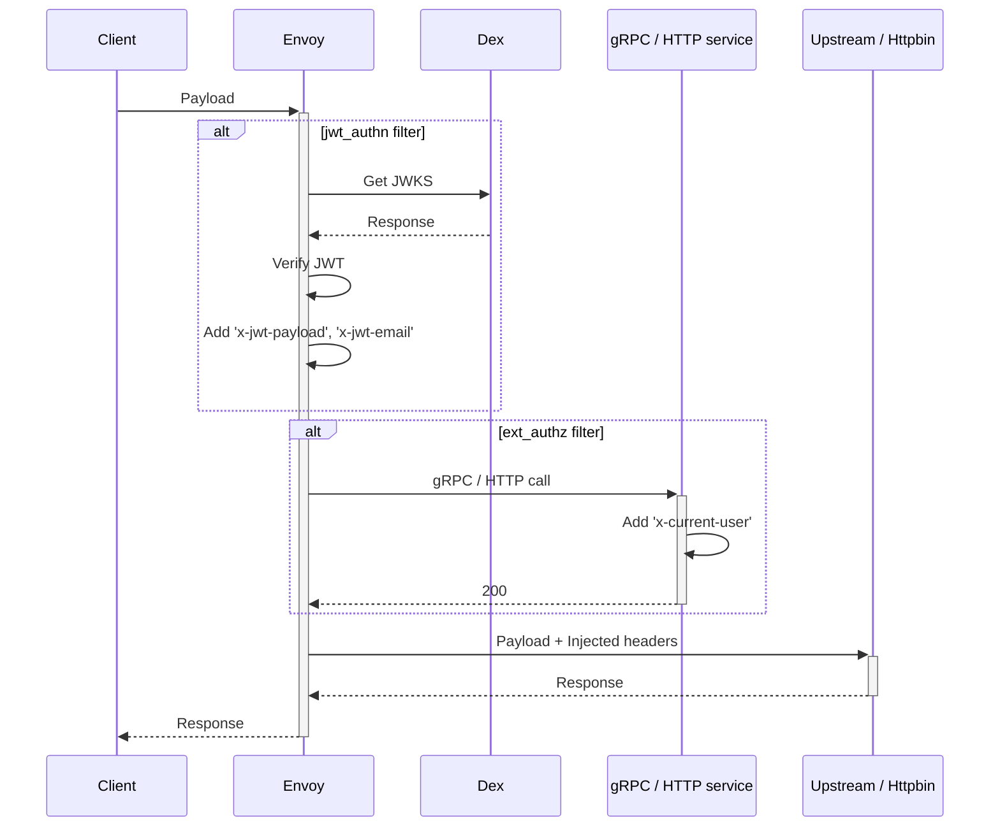

# Envoy Proxy for AuthN/AuthZ

Envoy Proxy Demo for Authentication and Authorization



## HTTP Webhook

```sh
FRONT_ENVOY_YAML=http-service.yaml docker-compose up -d front-envoy ext_authz-http-service upstream-service
# 403 forbidden response
curl -v localhost:8000/get
curl -I localhost:8000/get

# 200 response (with "X-Current-User" header)
curl -H "Authorization: Bearer token1" localhost:8000/get?show_env=1
curl -I -H "Authorization: Bearer token1" localhost:8000/get
```

## gRPC Webhook

```sh
FRONT_ENVOY_YAML=grpc-service.yaml docker-compose up -d front-envoy ext_authz-grpc-service upstream-service
# 403 forbidden response
curl -v localhost:8000/get
curl -I localhost:8000/get

# 200 response (with "X-Current-User" header)
curl -H "Authorization: Bearer token2" localhost:8000/get?show_env=1
curl -I -H "Authorization: Bearer token2" localhost:8000/get
```

## OPA

```sh
FRONT_ENVOY_YAML=opa-service.yaml docker-compose up -d front-envoy ext_authz-opa-service upstream-service
# GET is allowed
curl localhost:8000/get?show_env=1

# POST is forbidden (403)
curl -v -XPOST localhost:8000/get?show_env=1
```

## JWT Authentication

```sh
FRONT_ENVOY_YAML=jwt.yaml docker-compose up -d front-envoy upstream-service dex
# Discovery endpoint: http://dex.127.0.0.1.nip.io:5556/dex/.well-known/openid-configuration
# Get JWT via Auth Code Flow using Postman

curl -H "Authorization: Bearer ey..." localhost:8000/get
```

## Websocket

```sh
FRONT_ENVOY_YAML=websocket.yaml docker-compose up -d front-envoy upstream-websocket-service
```

## Dynamic Configuration

```sh
FRONT_ENVOY_YAML=dynamic.yaml docker-compose up -d front-envoy upstream-service
# if file is mounted in wsl, file changes are not picked up, use `sed` instead
# docker exec envoy sed -i s/8080/80/ /etc/envoy/dynamic/cds.yaml
```

## Reference

[Envoy Docs: ext_authz](https://www.envoyproxy.io/docs/envoy/latest/start/sandboxes/ext_authz)

[Extension configuration](https://www.envoyproxy.io/docs/envoy/latest/configuration/overview/extension)

[Configuration Reference: HTTP](https://www.envoyproxy.io/docs/envoy/latest/configuration/http/http)

[Network Filters](https://www.envoyproxy.io/docs/envoy/latest/configuration/listeners/network_filters/network_filters)

[HTTP Filters](https://www.envoyproxy.io/docs/envoy/latest/configuration/http/http_filters/http_filters)

[Dynamic Configuration](https://www.envoyproxy.io/docs/envoy/latest/configuration/overview/examples)

[envoy-opa-compose](http://github.com/shanesoh/envoy-opa-compose)

https://medium.com/swlh/securing-dockerized-microservices-with-open-policy-agent-and-envoy-c128dfc764fe

https://jbw.codes/Integrating-Keycloak-OIDC-with-Envoy-API-Gateway/
